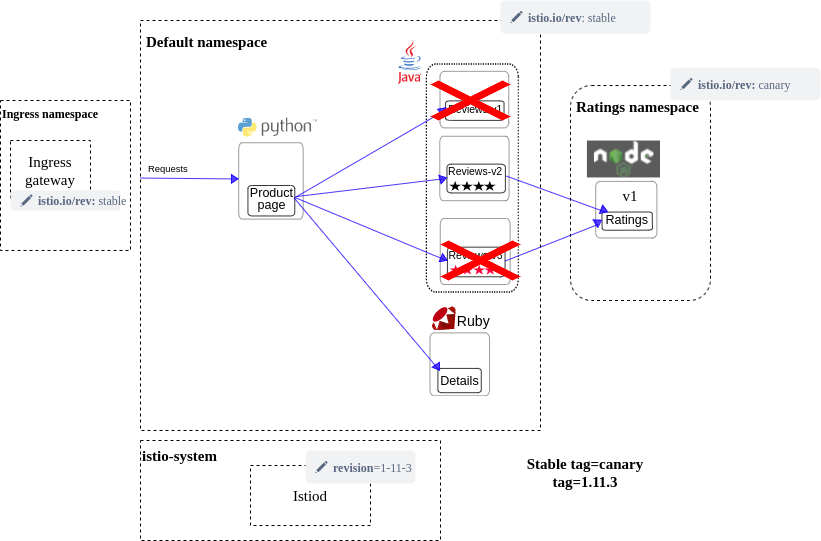
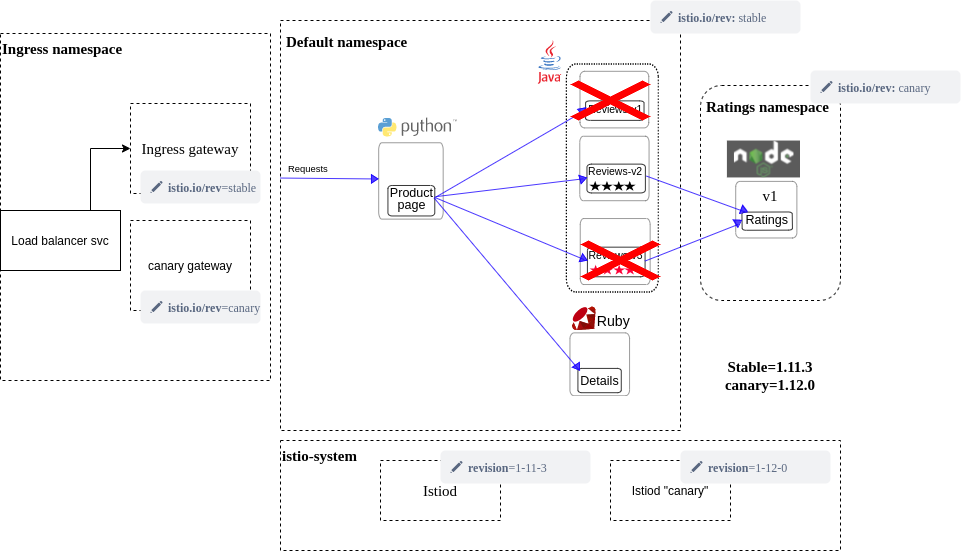

# Canary istio upgrade demo

We run this demonstration pretending to upgrade from istio 1.11.3 to 1.12.0 using 
independent ingress gateway, stable revision tags and a canary namespace.

We've modified the default bookinfo example to have the ratings service in different namespace
the start state is like this:
we've had to set an env variable on reviews to point at the right host and move all the ds and vr appropriately
to make this work

requirements:
- kind

Because we're running local, we approximate testing the gateway by port-forwarding the gateway service
9080-> 80 in check-app step in makefile. If routing works well it should mean that
the productpage, reviews and ratings should be accessible at `localhost:9080/productpage`

the steps to run through are threefold:

you can run:
`make workloads-phase1` which will cascade down the chain to setup the initial view illustrated above.

To start checking if there is any response you can run:
`make check-app` and `make port-forward` in a separate panel/tab to be periodically checking the status of the app

## Phase 2

once all the above make sense and you're able to is app is live on your terminal, you can run:
`make phase2`

- we start a new istiod with revision 1-12-0
- we push canary tag to match this new revision
- We rollout the ratings deployment, it's possible there is a small blip in our check-app
- We rollout a new gateway using the canary revision tag, it is not serving any traffic
- We ensure everything looks healthy

to demonstrate how all these steps are reversible, which is the other big advantage of this approach
you could run
`make revert-phase2`, note that naturally you have to go in a sequential order phase1 -> 2 -> 3 -> 4
and can revert each step one by one.

This is the state of the world after phase 2 is applied:

## Phase 3

We update the stable tag to revision 1-12-0, and "roll" all the applications,
this may result in a few dropped connections when the old pods are terminated but there will always be capacity.

We then make the service label in the service patched to point at canary ingressgateway

`kubectl patch service istio-ingressgateway -p '{"spec":{"selector":{"app": "istio-ingressgateway"}}}'`

we can revert these steps if there are any real difficulties other than the transient errors on rollout.

## Phase 4

Finally we can in-place upgrade the "old" gateway, decomission the new ingress gateway and old istiod.
we do this instead of keeping the canary and using it so that the state is similar to the initial state so 
you can always do this in future cleanly